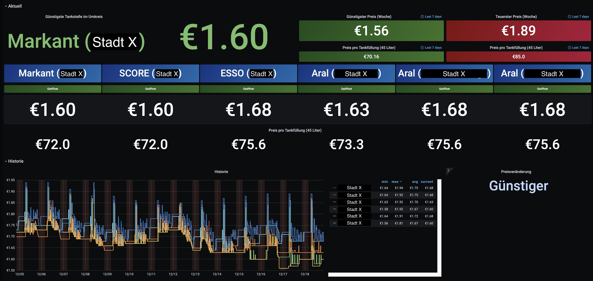

# iobroker-tankerkoenig-grafana-dashboard

Dieses Dashboard visualisiert Daten des Tankerkönig Adapters für [ioBroker](https://iobroker.net/) mit einer InfluxDB Datenbank als Datenquelle.

## Vorraussetzungen

- Grafana 6.7.3 oder höher
- InfluxDB Datenbank
- InfluxDB-Adapter konfiguriert und laufend in ioBroker
- Tankerkönig Adapter konfiguriert und laufend in ioBroker

## Installation

1. Lade die `dashboard.json` Datei von diesem Repository herunter.
2. In Grafana gehe zur Dashboard-Liste und klicke auf den "Importieren" Button in der oberen rechten Ecke.
3. Wähle die Option "Upload .json Datei" aus und wähle die heruntergeladene `dashboard.json` Datei aus.
4. Wähle die InfluxDB Datenquelle aus dem Dropdown-Menü aus.
5. Klicke auf den "Importieren" Button, um den Import des Dashboards abzuschließen.

## Verwendung

Das Dashboard sollte nun in der Dashboard-Liste verfügbar sein und kann durch Klicken auf den Namen geöffnet werden.

Das Dashboard enthält Panels, die verschiedene Aspekte der Daten vom Tankerkönig Adapter visualisieren, wie zum Beispiel die Preise verschiedener Treibstofftypen an verschiedenen Tankstellen. Verwende den Zeitbereich-Selector und den Aktualisieren Button in der oberen rechten Ecke, um die angezeigten Daten zu steuern.
